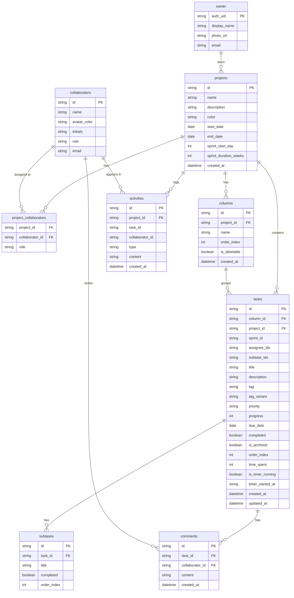

# Project Tracker Pro — Architecture

> Author: Development Team  
> Date: 2026-03-15  
> Status: Stable  
> Replaces: —

---

## Overview

Project Tracker Pro is a local-first, offline-capable Progressive Web App (PWA) for personal project and task management. The owner — a single authenticated user — creates projects, organises tasks on a Kanban board, tracks time, and manages collaborators. Collaborators are locally managed contacts; they do not need accounts to be referenced in tasks or projects.

All data lives on the user's device in a SQLite database running entirely in the browser via WebAssembly. No user data is transmitted to any server. The app installs on any device as a PWA and operates fully without a network connection after the first load. The UI is mobile-first and designed for instant interaction — the app shell loads from cache before the database is ready.

Firebase Authentication identifies the single owner. The app never invents its own user identities; the Firebase UID is the sole source of truth for the owner's identity. Collaborators, by contrast, are plain records the owner creates and manages locally — they have no authentication, no login, and no relationship to Firebase.

---

## Core Principles

1. All user data is stored on the device. Nothing is sent to a server without an explicit user action.
2. The app must be fully functional with no network connection after the initial install.
3. Identity for the app owner comes from Firebase Authentication. The app never generates its own owner IDs.
4. Collaborators are locally managed contacts. They are not auth accounts and carry no credentials.
5. The UI shell loads from cache before data is available. Data populates reactively once the database is ready.
6. Progressive enhancement governs optional APIs (OPFS, WebGPU). The app degrades gracefully when they are unavailable.
7. The database is the single source of truth. No application state is derived from `localStorage` except session flags unrelated to data.

---

## System Diagram

```
┌─────────────────────────────────────────────────────────────────┐
│                        Browser (PWA)                            │
│                                                                 │
│  ┌─────────────────────────────────────────────────────────┐   │
│  │                   UI Layer (Preact)                      │   │
│  │  Views: Board, Backlog, Sprint, Dashboard, Settings      │   │
│  │  Components: TaskCard, TaskForm, Avatar, Sidebar, Navbar │   │
│  │  Routing: preact-router                                  │   │
│  │  Animation: Motion    Drag & Drop: dnd-kit               │   │
│  │  Styling: Tailwind CSS v4                                │   │
│  └────────────────────────┬────────────────────────────────┘   │
│                           │ async calls                         │
│  ┌────────────────────────▼────────────────────────────────┐   │
│  │               Service Layer (db.ts)                      │   │
│  │  DatabaseService — all reads and writes                  │   │
│  │  IndexedDBStorage — snapshot persistence                 │   │
│  │  seeder.ts — initial data population                     │   │
│  └────────────────────────┬────────────────────────────────┘   │
│                           │ SQLite WASM API                     │
│  ┌────────────────────────▼────────────────────────────────┐   │
│  │           Persistence Layer (SQLite WASM)                │   │
│  │  @sqlite.org/sqlite-wasm — in-memory SQLite              │   │
│  │  OPFS (preferred) — persistent file-based storage        │   │
│  │  IndexedDB (fallback) — table snapshot backup            │   │
│  └─────────────────────────────────────────────────────────┘   │
│                                                                 │
│  ┌─────────────────────────────────────────────────────────┐   │
│  │              Service Worker (vite-plugin-pwa)            │   │
│  │  Cache-first for app shell and static assets             │   │
│  │  Network-first for dynamic requests                      │   │
│  │  offline.html fallback for navigation failures           │   │
│  └─────────────────────────────────────────────────────────┘   │
└──────────────────────────────────┬──────────────────────────────┘
                                   │ HTTPS (auth only)
             ┌─────────────────────▼──────────────────────┐
             │         Firebase Authentication             │
             │   Provides auth_uid for the app owner       │
             │   No user data stored server-side           │
             └────────────────────────────────────────────┘

             ┌────────────────────────────────────────────┐
             │         Express Server (optional)           │
             │   Routes Gemini AI API calls server-side    │
             │   Keeps API key out of the browser bundle   │
             └────────────────────────────────────────────┘
```

---

## Technology Stack

| Layer | Technology | Reason |
|---|---|---|
| UI framework | Preact 10 + React 19 compat | Smaller bundle than React; React 19 API compatibility via `preact/compat` |
| Language | TypeScript 5.8 | Type safety across db interfaces, component props, and service methods |
| Routing | preact-router 4 | Lightweight client-side routing; no server required |
| Styling | Tailwind CSS v4 | Utility-first; v4 integrates directly with Vite via `@tailwindcss/vite` |
| Animation | Motion 12 | Production-grade animation with minimal bundle cost |
| Drag and drop | dnd-kit 6 | Accessible, pointer and keyboard-friendly Kanban drag and drop |
| Icons | lucide-preact + lucide-react | Consistent icon set; both variants present for Preact/React compat layer |
| Database | @sqlite.org/sqlite-wasm 3.51 | Full SQLite in the browser via WASM; no server required |
| Primary storage | OPFS (Origin Private File System) | Persistent, fast, sandboxed file storage in the browser |
| Fallback storage | IndexedDB | Table snapshot backup when OPFS is unavailable |
| Build tool | Vite 6 | Fast HMR, WASM support via `vite-plugin-wasm`, PWA via `vite-plugin-pwa` |
| PWA | vite-plugin-pwa 0.21 | Service Worker generation, manifest, offline shell caching |
| WASM async support | vite-plugin-top-level-await | Enables top-level `await` required by sqlite-wasm initialisation |
| Auth | Firebase Authentication | Single owner identity via `auth_uid`; no user data stored server-side |
| AI features | @google/genai 1.29 | Gemini API integration for subtask generation and sprint planning |
| API proxy | Express 4 + better-sqlite3 | Server-side route for Gemini calls; keeps API key out of browser bundle |
| Seed script | tsx + better-sqlite3 | Node-side seeding via `npm run seed`; uses same schema as browser db |
| Type checking | `tsc --noEmit` | Unified lint gate; no separate ESLint config yet |

---

## Data Model

### Entity Relationship Diagram



### Entity Descriptions

**`owner`** — Represents the single authenticated user of the app. One row exists at most. Written on first Firebase sign-in via `db.setOwner()` and updated on subsequent sign-ins. Never deleted. `auth_uid` is the Firebase UID and is the only identity the app trusts for the owner.

**`collaborators`** — Locally managed contacts the owner creates to represent teammates, clients, or any person involved in a project. They carry no credentials and have no relationship to Firebase. The owner creates, edits, and deletes them freely via the Team view. Deleting a collaborator sets `collaborator_id` to NULL in `comments` and `activities` via `ON DELETE SET NULL`; it removes them from `project_collaborators` via `ON DELETE CASCADE`.

**`projects`** — The top-level organisational unit. Each project has its own columns, tasks, collaborators, and activity log. Created by the owner via the UI or seed script. Deleting a project cascades to all its columns, tasks, subtasks, comments, activities, and project_collaborator memberships.

**`project_collaborators`** — Join table scoping a collaborator's membership to a specific project. Uses a composite primary key `(project_id, collaborator_id)` — no synthetic ID needed. The owner adds and removes collaborators per-project in Project Settings. A collaborator can be a member of multiple projects simultaneously.

**`columns`** — Kanban columns belonging to a project. Each new project seeds four default columns: To Do, In Progress, Review, Done. The `is_deletable` flag protects the default columns. `order_index` controls display order and is updated on drag-and-drop reorder.

**`tasks`** — The core work unit. Belongs to both a column (for Kanban position) and a project (for filtering and cascade). `assignee_ids` and `subtask_ids` are comma-separated ID lists — a denormalized pattern consistent with the existing codebase that avoids join queries for the most common read path. `time_spent` stores elapsed seconds; the timer state is managed via `is_timer_running` and `timer_started_at`. Archiving sets `is_archived = 1` without deleting the row.

**`subtasks`** — Checklist items belonging to a task. Cascade-deleted with their parent task. `order_index` controls display order. The parent task's `subtask_ids` column is kept in sync by `db.addSubtask()` and `db.deleteSubtask()` so the UI can render subtask counts without an extra query.

**`comments`** — Free-text notes attached to a task, optionally attributed to a collaborator. `collaborator_id` is nullable — comments can be unattributed (written by the owner). Setting `collaborator_id` to a collaborator allows attribution display in the UI.

**`activities`** — Append-only audit log of events within a project (task created, status changed, member added, etc.). Never updated or deleted individually; the whole log is wiped only on `manualSeed()`. `collaborator_id` is nullable for events triggered by the owner directly.

---

## Key Flows

### 1. App startup and data load

Triggered when the user navigates to the app.

1. The Service Worker intercepts the navigation request and serves the cached app shell (`index.html` + bundled JS/CSS) instantly from cache — no network needed.
2. Preact boots and renders the UI shell (sidebar, navbar, empty board skeleton).
3. `db.init()` is called. It initialises the SQLite WASM module, locating the `.wasm` binary via Vite's asset URL.
4. `createTables()` runs — all `CREATE TABLE IF NOT EXISTS` statements execute. This is a no-op on every run after the first.
5. `db.init()` checks `SELECT count(*) FROM projects`. If zero, it reads IndexedDB for a prior snapshot. If a snapshot exists, it restores all tables. If no snapshot exists, `performSeed()` runs to populate demo data.
6. The UI re-renders with real data. Total time from navigation to interactive is dominated by WASM initialisation (~300–800ms on first cold load; faster on repeat visits via OPFS).

Failure mode: if WASM fails to load (no network, no cache), the Service Worker serves `offline.html`.

### 2. Creating a task

Triggered when the owner submits the task creation form.

1. The form calls `db.addTask()` with title, column, project, priority, and optional assignee IDs.
2. `addTask()` inserts the row into `tasks` with an empty `subtask_ids` field.
3. `schedulePersist()` starts a 2-second debounce timer.
4. The UI receives the new task ID and optimistically adds the card to the board without waiting for the persist timer.
5. After 2 seconds of inactivity, `persist()` dumps all tables to IndexedDB as a snapshot.

### 3. Subtask creation and sync

Triggered when the owner adds a subtask in the Task Detail modal.

1. `db.addSubtask(taskId, title)` inserts a row into `subtasks`.
2. Immediately after, it updates the parent task's `subtask_ids` column by appending the new subtask ID to the existing comma-separated list.
3. The UI reads `subtask_ids` from the task to render the subtask count badge on the card without a separate query to `subtasks`.
4. The full subtask list is fetched via `db.getSubtasks(taskId)` only when the Task Detail modal opens.

### 4. Persistence and recovery

Triggered on a 2-second debounce after any write, and immediately on `visibilitychange` (tab hidden or closed).

1. `persist()` iterates the table list in dependency order.
2. For each table it reads all columns via `PRAGMA table_info`, then reads all rows via `SELECT *`, converting snake_case column names to camelCase.
3. The full snapshot is written to IndexedDB via `IndexedDBStorage.writeAllTables()`.
4. On next app startup, `db.init()` finds this snapshot and restores it before the user sees anything.

Edge case: `visibilitychange` is used instead of `beforeunload` because `beforeunload` is unreliable on mobile browsers and in some Chromium versions when the tab is discarded.

### 5. Collaborator assignment to a task

Triggered when the owner picks collaborators in the task assignee picker.

1. The UI calls `db.getProjectCollaborators(projectId)` to populate the picker. This joins `collaborators` with `project_collaborators` scoped to the current project.
2. The owner selects one or more collaborators. Their IDs are written to `task.assigneeIds`.
3. `db.updateTask(taskId, { assigneeIds })` serialises the array to a comma-separated string and updates the `assignee_ids` column.
4. `TaskCard` reads `assigneeIds` from the task and looks up display data from the local collaborators list to render avatar stacks.

---

## Decision Records

### DR-001: SQLite WASM over IndexedDB as the primary database

**Date:** 2026-01-10  
**Status:** Accepted

**Context:** The app needed a relational query layer with foreign keys, joins, and ordered queries. IndexedDB is a key-value store that requires manual query logic for anything beyond simple lookups.

**Decision:** Use `@sqlite.org/sqlite-wasm` running in the browser as the primary database, with IndexedDB used only as a persistence snapshot layer.

**Alternatives considered:**
- IndexedDB directly — rejected because relational queries (join columns to tasks, collaborators to projects) would require manual client-side joins and sorting.
- PGlite (PostgreSQL WASM) — rejected; heavier bundle, less mature browser support at the time of the decision.

**Consequences:** WASM initialisation adds ~300–800ms to cold start. Top-level `await` is required in the module init path, necessitating `vite-plugin-top-level-await`. The `.wasm` binary must be served with the correct MIME type and cached by the Service Worker.

---

### DR-002: Local-first, no sync backend

**Date:** 2026-01-10  
**Status:** Accepted

**Context:** The target user is an individual who wants full data ownership and offline reliability. A cloud backend would add auth complexity, server costs, and a network dependency.

**Decision:** All data is stored on-device. No sync service is implemented in the initial version.

**Alternatives considered:**
- Firebase Firestore — rejected; requires constant connectivity for real-time sync and moves data off-device.
- CRDTs + custom sync (e.g. Automerge) — rejected; significant complexity for a single-owner app with no concurrent editing requirement.

**Consequences:** Collaboration is limited to the owner's single device. Multi-device sync is out of scope until a future encrypted backup feature (Zync, Phase 3) is implemented. Data loss on device failure is possible without manual export.

---

### DR-003: Collaborators are local contacts, not auth accounts

**Date:** 2026-03-15  
**Status:** Accepted

**Context:** The ROADMAP Phase 0 migration treated `users` as a broken auth table and replaced it with `project_members` keyed on Firebase UIDs. This was incorrect for the actual use case: the app is single-owner and collaborators are people the owner tracks locally for assignment and visibility purposes, regardless of whether those people use the app themselves.

**Decision:** Restore a `collaborators` table as locally managed contacts with no auth relationship. Firebase Authentication is used exclusively to identify the one app owner via `auth_uid`.

**Alternatives considered:**
- Full `project_members` model (Firebase UIDs only) — rejected; forces every collaborator to have a Firebase account, breaking the local-first and personal-use model.
- Keep the old `users` table name — rejected; the name implied auth users and caused the original confusion. `collaborators` is unambiguous.

**Consequences:** Collaborators cannot log in or see the app unless the owner shares their device. If a future sync feature is added, collaborators can gain an optional `sync_uid` field without changing the base model.

---

### DR-004: Preact over React as the UI framework

**Date:** 2026-01-10  
**Status:** Accepted

**Context:** The app targets mobile devices where bundle size directly affects load time and installation size. Preact offers React API compatibility at a fraction of the bundle cost.

**Decision:** Use Preact 10 as the UI framework with `preact/compat` providing React 19 API compatibility for ecosystem libraries.

**Alternatives considered:**
- React 19 directly — rejected; ~45KB larger gzipped bundle for no functional difference in this use case.
- Solid.js — rejected; smaller ecosystem and incompatible with React-targeted component libraries (dnd-kit, lucide-react).

**Consequences:** Some React-specific libraries require the `preact/compat` alias in the Vite config. Both `lucide-preact` and `lucide-react` are present in `package.json` to handle compat layer edge cases. Hooks and context work identically to React.

---

### DR-005: Express server for Gemini API proxy

**Date:** 2026-03-15  
**Status:** Accepted

**Context:** The Gemini API key must not be exposed in the browser bundle. Any key embedded in client-side JavaScript can be extracted from the source.

**Decision:** Route all Gemini API calls through a lightweight Express server. The server holds the API key via environment variable; the browser calls the Express endpoint, not the Gemini API directly.

**Alternatives considered:**
- Hardcode the key in the browser bundle behind obfuscation — rejected; obfuscation is not security.
- Serverless function (Cloudflare Worker, Vercel Edge) — deferred; adds deployment complexity. Express is already a dependency and sufficient for the current use case.

**Consequences:** AI features require the Express server to be running. The PWA's offline mode cannot use AI features. `better-sqlite3` is also used server-side for the seed script, so the Express server shares the dependency.

---

## Out of Scope

- Multi-user real-time sync — collaborators are local contacts only; no collaborative editing across devices is implemented.
- Server-side data storage — no user data is persisted on any server in this version.
- Collaborator authentication — collaborators have no login, no password, and no Firebase account.
- End-to-end encryption of local data — the SQLite file is stored in OPFS without encryption at the application layer.
- Push notifications — not implemented; the Service Worker handles caching only.
- Automated database migrations — schema changes require a version bump of the IndexedDB store name and a clean restore from snapshot.

---

## Open Questions

| Question | Owner | Target |
|---|---|---|
| Should OPFS be the primary store with IndexedDB as fallback, or should both run in parallel? Currently IndexedDB is the only durable store. | DB layer | Phase 1 |
| `vite-plugin-pwa` migration is incomplete — `CACHE_NAME` must be bumped manually on every deploy until resolved. | Frontend | Phase 2 |
| The Express server has no authentication. Any process on localhost can call the Gemini proxy. Is this acceptable for the target deployment? | Backend | Phase 3 |
| Should `activities` be prunable (e.g. keep last 500 per project) to prevent unbounded table growth? | DB layer | Phase 2 |
